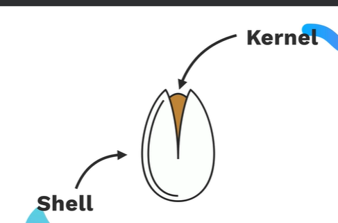
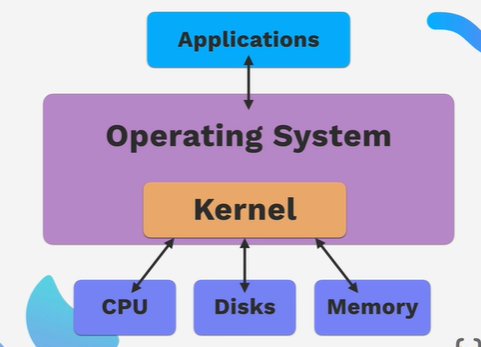

# why we need to learn command line interface?
## as a developer command line is useful when you want to navigate throgh different directories.


## cli provides direct navigation of directory that gui can't provide.
# useful commands:
1. ## ls (list files and directories)
    * ls provides list of directories insides current directory.
    ``` bash
    HP@KARAN MINGW64 /f/Self Learning/Web-development/mern_stack_learning (main)
    $ ls
    css/   git/   html/   javascript/   npm_Package_manager/  'unix commands
    ```
2. ## cd (change directory)
    * this is use to change current directory.
    ```bash
    #before cd
    HP@KARAN MINGW64 /f/Self Learning/Web-development/mern_stack_learning (main) $ cd unix\ commands/
    # after cd
    HP@KARAN MINGW64 /f/Self Learning/Web-development/mern_stack_learning/unix commands (main)
    ```
    * when we don't want to type full directory we just click tab.
    * when we want to go to root that is user in c drive then we use `cd ~`
    * when we want to go backwards then we use `cd ..`
3. ## some shortcut
    * `clt + u` = use to clear command.
    * `clt + a` = use to move cursor at first place.
    * `clt + u` = use to clear command.
4. ## create,opening and removing files
    * `cd touch [file name]` is used to create file.
    * `cd start [file name]` is used to open file.
    * `rm [file name]` is used to delete file.
    * `rm *`is used to delete all files.
    * `code [file name]` is used to open file in vscode.
    * `pwd` is used to know current directory.
    * `mkdir` is used to create new directory.